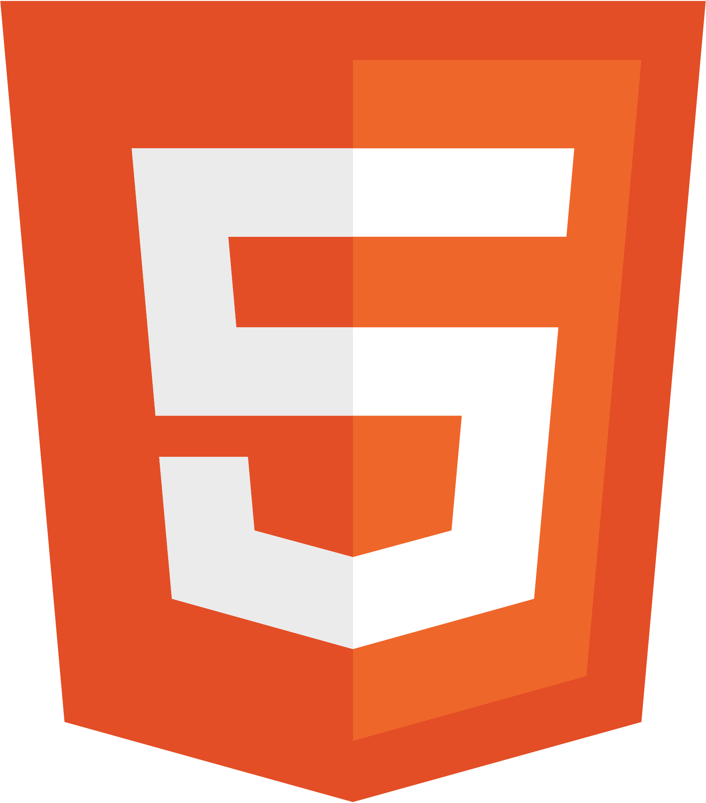

## About Me:
Hi 👋, my name is Muhammad Raihan Resa   🮠I like playing games  🔠My focus is on the front end developer  🔥 I am dedicated to creating engaging user interfaces and smooth user experiences  

## 🌐 Social Media:
&nbsp;&nbsp;&nbsp;&nbsp;
&nbsp;&nbsp;&nbsp;&nbsp;
  

## 💻 Tools:
&nbsp;&nbsp;&nbsp;&nbsp;
&nbsp;&nbsp;&nbsp;&nbsp;
&nbsp;&nbsp;&nbsp;&nbsp;
&nbsp;&nbsp;&nbsp;&nbsp;
&nbsp;&nbsp;&nbsp;&nbsp;
&nbsp;&nbsp;&nbsp;&nbsp;
    

    

